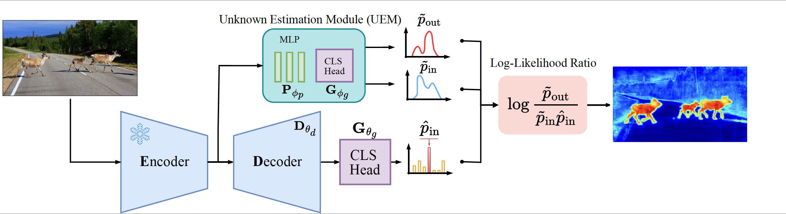

# A Likelihood Ratio-Based Approach  to Segmenting Unknown Objects

[Nazir Nayal](https://nazirnayal.xyz/), [Youssef Shoeb](https://scholar.google.com/citations?user=1y9CiFUAAAAJ&hl=en), [Fatma Güney](https://mysite.ku.edu.tr/fguney/)

[[`arXiv`](https://arxiv.org/abs/2409.06424)][[`BibTeX`](#CitingUEM)]


<div align="center">
  
</div><br/>


## Installation

Create the environment
```
conda create -n uem python=3.10
```

Install Pytorch:
```
pip install torch==2.2.0 torchvision==0.17.0 torchaudio==2.2.0 --index-url https://download.pytorch.org/whl/cu118
```

Compile custom cuda kernels
```
cd modeling/modules/pixel_decoder/ops/
sh make.sh
```

Install required packages:
```
pip install -r requirements.txt
```

## Dataset Preparation

We follow the exact same data preparation steps and format as described [here](https://github.com/NazirNayal8/RbA/blob/main/datasets/README.md)

## Model Zoo

### Segmentation Models

We provide two semantic segmentation models trained only on the 19 classes of cityscapes. One model is trained with a GMM head, and the other with a linear discriminative head.

<table><tbody>
<!-- START TABLE -->
<!-- TABLE HEADER -->

<tr>
<th valign="bottom">Backbone</th>
<th valign="bottom"> Head </th>
<th valign="bottom">Cityscapes mIoU</th>
<th valign="bottom" align="middle">config</th>
<th valign="bottom" align="middle">ckpt</th> </tr>
<!-- TABLE BODY -->
<tr><td align="left">dinov2_vitb14_reg</td>
<td align="center">GMM</td>
<td align="center">82.57</td>
<td align="center"><a href="configs/segmentation/cityscapes/gmm.yaml">config</a></td>
<td align="center"><a href="">model</a></td>
</tr>

<tr><td align="left">dinov2_vitb14_reg</td>
<td align="center">Linear</td>
<td align="center">83.11</td>
<td align="center"><a href="configs/segmentation/cityscapes/discriminative.yaml">config</a></td>
<td align="center"><a href="">model</a></td>
</tr>

</tbody></table>

### OoD Models

<table><tbody>
<!-- START TABLE -->
<!-- TABLE HEADER -->
<tr>  <td valign="bottom" colspan="2" >  </td>
    <td valign="bottom" colspan="2" align="center"> <b>SMIYC-AT</b> </td>
    <td valign="bottom" colspan="2" align="center"> <b>SMIYC-OT</b> </td>
    <td valign="bottom" colspan="2" align="center"> <b>Road Anomaly</b> </td>
    <td valign="bottom" colspan="2" align="center"> <b>FS LaF</b> </td>
</tr>
<tr>
<th valign="bottom">Segmentor</th>
<th valign="bottom">UEM Type</th>
<th valign="bottom" align="center">AP</th>
<th valign="bottom">FPR95</th>
<th valign="bottom" align="center">AP</th>
<th valign="bottom">FPR95</th>
<th valign="bottom" align="center">AP</th>
<th valign="bottom">FPR95</th>
<th valign="bottom">AP</th>
<th valign="bottom">FPR95</th>
<th valign="bottom" align="middle">config</th>
<th valign="bottom" align="middle">ckpt</th> </tr>
<!-- TABLE BODY -->
<tr><td align="left">GMM</td>
<td align="center">GMM (G-G)</td>
<td align="center">94.10</td>
<td align="center">6.90</td>

<td align="center">88.30</td>
<td align="center">0.40</td>

<td align="center">93.75</td>
<td align="center">6.32</td>

<td align="center">71.34</td>
<td align="center">6.04</td>

<td align="center"><a href="configs/segmentation/ood/g_g.yaml">config</a></td>
<td align="center"><a href="">model</a></td>
</tr>

<tr><td align="left">GMM</td>
<td align="center">Discriminative (G-D)</td>

<td align="center">92.50</td>
<td align="center">11.30</td>

<td align="center">92.0</td>
<td align="center">0.20</td>

<td align="center">92.86</td>
<td align="center">8.95</td>

<td align="center">79.02</td>
<td align="center">1.62</td>

<td align="center"><a href="configs/segmentation/ood/g_d.yaml">config</a></td>
<td align="center"><a href="">model</a></td>
</tr>

<tr><td align="left">Discriminative</td>
<td align="center">Discriminative (D-D)</td>

<td align="center">95.60</td>
<td align="center">4.70</td>

<td align="center">94.40</td>
<td align="center">0.10</td>

<td align="center">90.94</td>
<td align="center">8.03</td>

<td align="center">72.83</td>
<td align="center">2.60</td>

<td align="center"><a href="configs/segmentation/ood/d_d.yaml">config</a></td>
<td align="center"><a href="">model</a></td>
</tr>

</tbody></table>


## Evaluation

The script `evaluate_ood.py` is provided for evaluating on the OoD datasets Road Anomaly and Fishyscapes LaF. You can run an evaluation as follows:

```
python evaluate_ood.py --ckpt PATH_TO_CKPT \
     --devices 0 \  # can be 0,1,2,3 for e.g. in case of multi-gpu
     --datasets-folder /PATH-TO-DATASETS/datasets/ \
     --multiple-datasets \
     --dataset ra_and_fslaf \
     --out-path results/ \
     --segmentor-ckpt ckpts/d_d/linear-segmentor.ckpt \
```

The checkpoints are released on github and can be downloaded from there.

## Training

The config files for training are available in the model zoo. There are two stages for training:

1. Train a Segmentor (inlier model)
2. Train a UEM on top of a segmentor (OoD Training)

A segmentor can be trained as follows:
```
python train_segmentor.py --config configs/segmentation/cityscapes/discriminative.yaml \
SOLVER.BATCH_SIZE 4 \ # this is per gpu
DATA.DATASET_ROOT PATH_TO_CITYSCAPES_DATASET_ROOT
```

UEM can be trained as follows:

```
python train_ood.py --config PATH_TO_CONFIG \
 MODEL.SEGMENTOR_CKPT PATH_TO_SEGMENTOR_CKPT \
 SOLVER.BATCH_SIZE 4 \ # this is per gpu
 DATA.DATASET_ROOT datasets/cityscapes \
 DATA.DATASETS_FOLDER datasets/ \
 DATA.COCO_ROOT datsets/coco \
```

Note that paths to datasets need to be overwritten accordingly.


## <a name="CitingUEM"></a>Citing UEM
 
 ```BibTeX
@article{nayal2024likelihood,
  title={A Likelihood Ratio-Based Approach to Segmenting Unknown Objects},
  author={Nayal, Nazir and Shoeb, Youssef and G{\"u}ney, Fatma},
  journal={arXiv preprint arXiv:2409.06424},
  year={2024}
}
```